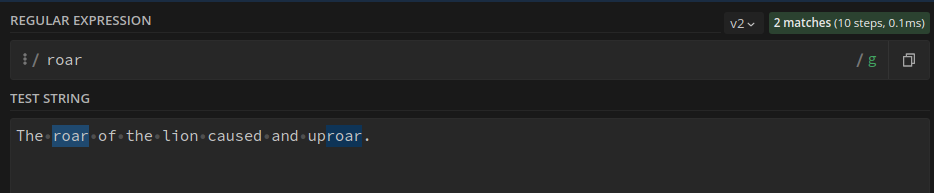

# RegEx Review

Regular Expressions or RegEx or RegExp help extract specific information from a given piece of text. It is used to locate or validate a string from a given text. Almost all programming languages support RegEx. This document is meant to be a quick cheatsheet of some of the most used Regular Expressions.

## Summary

Briefly summarize the regex you will be describing and what you will explain. Include a code snippet of the regex. Replace this text with your summary.


## Table of Contents

- [Anchors](#anchors)
- [Quantifiers](#quantifiers)
- [OR Operator](#or-operator)
- [Character Classes](#character-classes)
- [Flags](#flags)
- [Grouping and Capturing](#grouping-and-capturing)
- [Bracket Expressions](#bracket-expressions)
- [Greedy and Lazy Match](#greedy-and-lazy-match)
- [Boundaries](#boundaries)
- [Back-references](#back-references)
- [Look-ahead and Look-behind](#look-ahead-and-look-behind)

## Regex Components

### Anchors
Anchors in RegEx are not used to match any character. They are used to match **a position** before or after characters.

* ```^``` - The caret anchor matches the beginning of the text.
* ```$``` - The dollar anchor matches the end of the text.

Examples:

**```^Hi```** - matches any string that **starts with Hi**.


**```Shawn$```** - matches a string that **ends with Shawn**


**```^Willy Wonka$```** - **exact string match** (starts and ends with Willy wonka)

**Exact string match** fails.


**roar** - matches any string that has the text **roar** in it.


### Quantifiers
The purpose of the Quantifiers is to specify how many instances of a character or a group must be present in an input text for a match.

Examples:

**```xyz*```** - matches a string that has **xy followed by zero or more z**.


**```xyz+```** - matches a string that has **xy followed by one or more z**.


**```xyz?```** - matches a string that has **xy followed by zero or one z**.


**```xyz{2}```** - matches a string that has **xy followed by 2 z**.


**```xyz{2,}```** - matches a string that has **xy followed by 2 or more z**.


**```xyz{2,5}```** - matches a string that has **xy followed by 2 up to 5 z**.


**```x(yz)*```** - matches a string that has **x followed by zero or more copies of the sequence yz**.


### OR Operator
The Or operator ```|``` or ```[]``` is used to pick from two choices.

Examples:

**```x(y|z)```** - matches a string that has **x followed by y or z**.


**```x[yz]```** - matches a string that has **x followed by y or z from the list**


### Character Classes
Character classes defines a set of character that when present in an input string results in a match.

**```\d```** - matches a **single character** that is a **digit**.


**```\w```** - matches a **word character** (alphanumeric character plus underscore).


**```\s```** - matches a **whitespace character** (includes tabs)


**```.```** - matches **any character**. Use this class carfully. Often class or negated character class are faster and more precise.


```\d```, ```\w``` and ```\s``` have negated class which are ```\D```, ```\W``` and ```\S``` respectively.

### Flags
Flags are accessor properties that changes how a search is conducted on a given string.

* **```g```** (global) restarts the search from the end of the previous match instead of stopping after the frst match.
* **```m```** (multi-line) allows the ```^``` and the ```$``` anchors to use start and the end of a line, instead of the whole string.
* **```i```** (insensitive) makes the RegEx case insensitive.

### Grouping and Capturing

### Bracket Expressions

### Greedy and Lazy Match

### Boundaries

### Back-references

### Look-ahead and Look-behind

## Author

A short section about the author with a link to the author's GitHub profile (replace with your information and a link to your profile)
